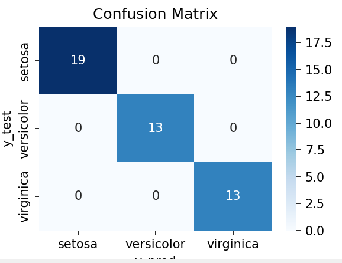
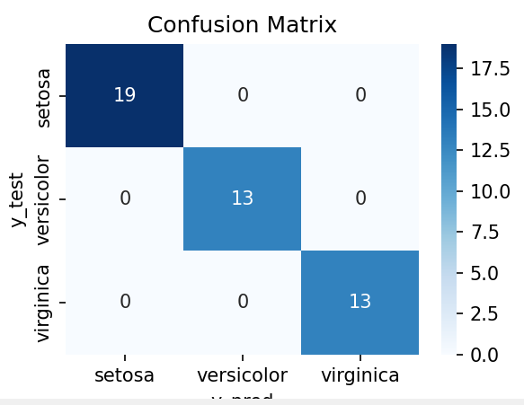
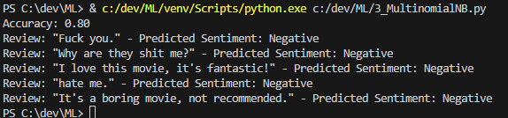
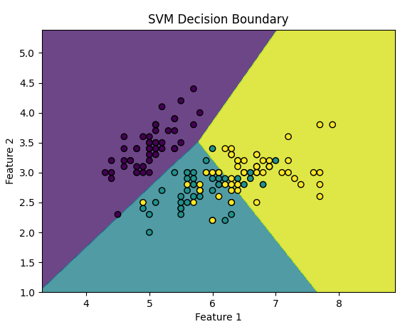
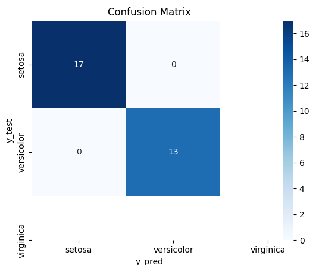
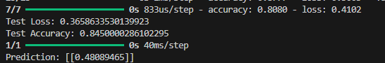
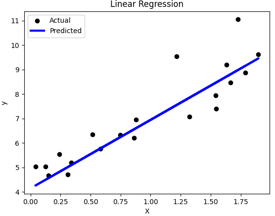
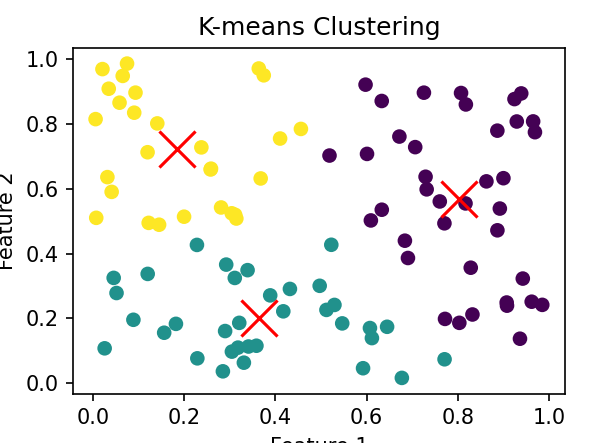
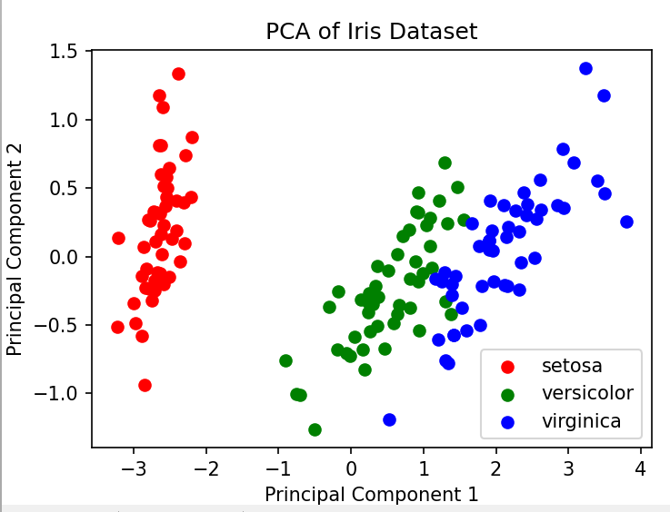

# 機械学習でよく使うもの

## -------教師あり学習---------------------

### 識別（AかBか）
- 決定木 \
アイリスデータセットを使用した例 \
    1_DecisionTreeClassifier.py \
    

- ランダムフォレスト \
アイリスデータセットを使用した例 \
    2_RandomForestClassifier.py \
    

- ナイーブベイズ \
    主に自然言語の分類で使用される \
    3_MultinomialNB.py \
    

- サポートベクターマシン（SVM） \
    4_svm.py \
    

- ロジスティック回帰 \
    計算が難しい
    5_LogisticRegression.py \
    

- 2値分類のニューラルネットワーク \
    6_make_classification.py
    

### 回帰
- 回帰分析 \
    7_LinearRegression.py \
    

### 分類
- k-means法 \
    8_KMeans.py \
     \

 
 

## -------教師なし学習----------------------- 
- 主成分分析 \
    9_PCA.py \
    

